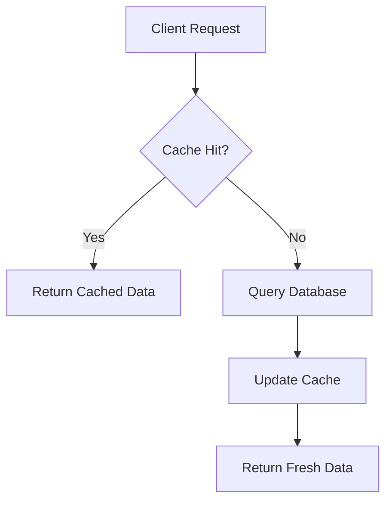
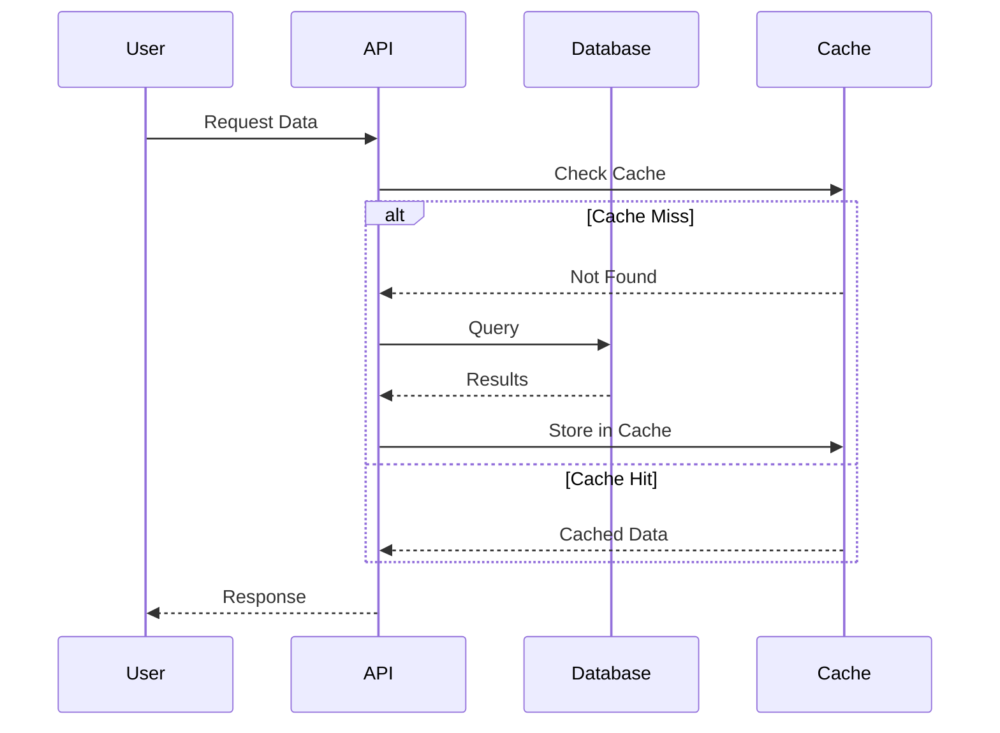

# Visuals and Diagrams in Technical Posts

## Why Visuals Matter

Technical concepts often benefit from visual representation. A well-placed diagram can convey complex relationships more effectively than paragraphs of text, while screenshots provide concrete evidence of results.

## Types of Technical Visuals

### 1. Architecture Diagrams
Show system structure and component relationships:
- **System Overview** - High-level component layout
- **Data Flow** - How information moves through the system
- **Deployment Topology** - Infrastructure and network layout
- **Sequence Diagrams** - Temporal flow of operations

### 2. Performance Visualizations
Demonstrate improvements with data:
- **Before/After Comparisons** - Bar charts, line graphs
- **Flame Graphs** - CPU profiling visualization
- **Latency Distributions** - Histograms, percentile plots
- **Time Series** - Metrics over time

### 3. Process Illustrations
Explain workflows and algorithms:
- **Flowcharts** - Decision trees and process flows
- **State Machines** - System states and transitions
- **Pipeline Diagrams** - Build/deploy processes
- **Algorithm Visualizations** - Step-by-step operation

### 4. Code Visualizations
Enhance code understanding:
- **Diff Views** - Show code changes clearly
- **Syntax Trees** - AST representations
- **Memory Layouts** - Data structure visualization
- **Call Graphs** - Function relationships

### 5. UI/UX Screenshots
Show user-facing changes:
- **Feature Comparisons** - Side-by-side views
- **User Flows** - Multi-step processes
- **Error States** - What users see when things fail
- **Progressive Enhancement** - Loading states

## Creating Effective Diagrams

### Mermaid Diagrams
Use Mermaid for version-controlled, text-based diagrams:





### ASCII Diagrams
For simple illustrations in code blocks:

```
┌─────────────┐     ┌─────────────┐     ┌─────────────┐
│   Browser   │────▶│  Load       │────▶│   CDN       │
│             │     │  Balancer   │     │             │
└─────────────┘     └─────────────┘     └─────────────┘
                            │
                            ▼
                    ┌─────────────┐
                    │   App       │
                    │  Servers    │
                    └─────────────┘
                            │
                    ┌───────┴───────┐
                    ▼               ▼
            ┌─────────────┐ ┌─────────────┐
            │  Primary    │ │  Read       │
            │  Database   │ │  Replicas   │
            └─────────────┘ └─────────────┘
```

### Screenshot Best Practices

1. **Annotation is Key**
   - Add arrows, circles, or callouts
   - Highlight the important parts
   - Blur sensitive information
   - Add captions explaining what to notice

2. **Consistent Sizing**
   - Use standard widths (e.g., 800px)
   - Maintain aspect ratios
   - Optimize file sizes
   - Use appropriate formats (PNG for UI, JPG for photos)

3. **Context Inclusion**
   - Show enough UI to orient readers
   - Include relevant browser chrome if needed
   - Display actual data, not lorem ipsum
   - Show realistic scenarios

## Performance Visualization Examples

### Latency Improvement Chart
```
Response Time (ms)
│
│ 2500 ┤ ████████████████████████
│ 2000 ┤ ████████████████████████
│ 1500 ┤ ████████████████████████
│ 1000 ┤ ████████████████████████  
│  500 ┤ ████████████████████████  ████████
│    0 └────────────────────────────────────
         Before Optimization      After

         P50: 1800ms             P50: 200ms
         P95: 2400ms             P95: 450ms
         P99: 2480ms             P99: 520ms
```

### Cost Reduction Visualization
```
Monthly AWS Costs
│
│ $50k ┤ ████████
│ $40k ┤ ████████ 
│ $30k ┤ ████████ ████████
│ $20k ┤ ████████ ████████ ████████
│ $10k ┤ ████████ ████████ ████████ ████████
│   $0 └─────────────────────────────────────
         Jan      Feb      Mar      Apr
        
         Key Changes:
         Feb: Implemented caching
         Mar: Moved to spot instances
         Apr: Optimized database queries
```

## Tools and Resources

### Diagram Creation Tools
- **Mermaid** - Text-based, version-controlled diagrams
- **draw.io** - Free web-based diagramming
- **Excalidraw** - Hand-drawn style diagrams
- **Lucidchart** - Professional diagramming
- **PlantUML** - Text-based UML diagrams

### Screenshot Tools
- **CloudApp** - Quick annotation and sharing
- **Snagit** - Professional screenshot editing
- **macOS Screenshot** - Built-in with markup
- **ShareX** - Open source for Windows
- **Flameshot** - Linux screenshot tool

### Data Visualization
- **Grafana** - Time series visualization
- **D3.js** - Custom interactive charts
- **Chart.js** - Simple chart library
- **Plotly** - Scientific plotting
- **Apache ECharts** - Comprehensive charting

## Visual Design Principles

### 1. Clarity Over Aesthetics
- Remove unnecessary decorations
- Use high contrast
- Keep labels readable
- Avoid 3D effects

### 2. Consistent Visual Language
- Use the same colors for same concepts
- Maintain consistent shapes
- Apply uniform styling
- Create a legend if needed

### 3. Progressive Complexity
- Start with simple overview
- Add detail in subsequent diagrams
- Use animation sparingly
- Build up understanding gradually

### 4. Accessibility Considerations
- Don't rely on color alone
- Add alt text descriptions
- Ensure sufficient contrast
- Provide text alternatives

## Common Visual Mistakes

1. **Information Overload**
   - Too many elements in one diagram
   - Unclear relationships
   - Missing visual hierarchy

2. **Poor Quality**
   - Blurry screenshots
   - Inconsistent sizing
   - Low contrast text

3. **Missing Context**
   - No labels or legends
   - Unclear what to focus on
   - No explanation of visual

4. **Decorative Not Functional**
   - Stock photos that add no value
   - Generic diagrams
   - Visuals that don't support the narrative

## Visual Integration Checklist

- [ ] Each visual has a clear purpose
- [ ] Diagrams are introduced before shown
- [ ] Screenshots are annotated appropriately
- [ ] File sizes are optimized
- [ ] Alt text provided for accessibility
- [ ] Consistent visual style throughout
- [ ] Data visualizations are honest and clear
- [ ] Complex diagrams have explanatory text
- [ ] Source files are version controlled
- [ ] Mobile rendering considered