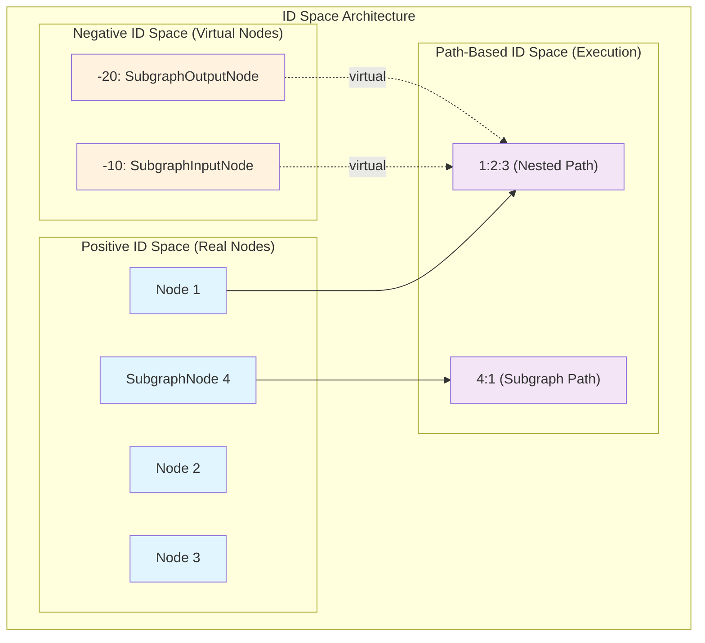
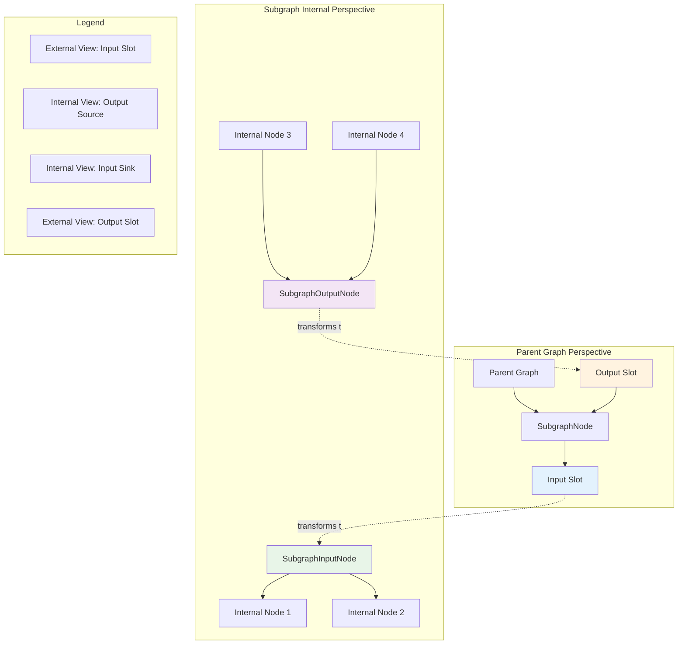
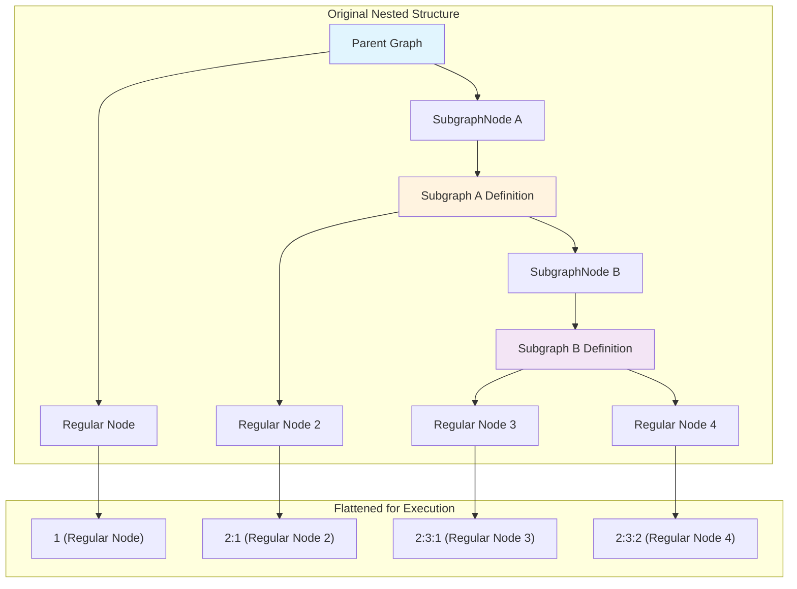

# LiteGraph Subgraph System Deep Dive

## Overview

The subgraph system in @ComfyOrg/litegraph (v0.16.0+) enables hierarchical graph composition, allowing graphs to contain reusable subgraph nodes. This investigation covers the complete architecture, implementation details, and current state of the subgraph feature.

## Architecture

### Visual Overview

#### Core Class Hierarchy
```mermaid
classDiagram
    class LGraph {
        +nodes: LGraphNode[]
        +links: Map~LinkId, LLink~
        +subgraphs: Map~UUID, Subgraph~
        +convertToSubgraph(items) SubgraphNode
        +createSubgraph(config) Subgraph
    }

    class Subgraph {
        +id: UUID
        +name: string
        +inputNode: SubgraphInputNode
        +outputNode: SubgraphOutputNode
        +inputs: SubgraphInput[]
        +outputs: SubgraphOutput[]
        +events: CustomEventTarget
        +addInput(name, type) SubgraphInput
        +addOutput(name, type) SubgraphOutput
    }

    class SubgraphNode {
        +subgraph: Subgraph
        +type: UUID
        +isVirtualNode: true
        +configure(info)
        +getInnerNodes() ExecutableNodeDTO[]
        +resolveSubgraphInputLinks()
        +resolveSubgraphOutputLink()
    }

    class SubgraphIONodeBase {
        <<abstract>>
        +id: number
        +graph: Subgraph
        +pos: [number, number]
        +size: [number, number]
        +draw(ctx, canvas)
        +getSlotDrawingInfo()
    }

    class SubgraphInputNode {
        +id: -10
        +slots: SubgraphInput[]
        +computeSize()
    }

    class SubgraphOutputNode {
        +id: -20
        +slots: SubgraphOutput[]
        +computeSize()
    }

    class ExecutableNodeDTO {
        +id: string
        +originalId: number
        +inputs: ResolvedConnection[]
        +resolveInput(index)
        +resolveOutput(index)
        +asSerialisable()
    }

    LGraph ||--o{ Subgraph : contains
    LGraph ||--o{ SubgraphNode : contains
    Subgraph ||--|| SubgraphInputNode : has
    Subgraph ||--|| SubgraphOutputNode : has
    SubgraphNode ||--|| Subgraph : references
    SubgraphIONodeBase <|-- SubgraphInputNode
    SubgraphIONodeBase <|-- SubgraphOutputNode
    SubgraphNode --> ExecutableNodeDTO : flattens to
```

#### Dual ID Space Architecture


### Core Classes

1. **Subgraph** (`src/subgraph/Subgraph.ts`)
   - Extends `LGraph` to create a nested graph structure
   - Manages subgraph inputs, outputs, and exposed widgets
   - Contains `SubgraphInputNode` and `SubgraphOutputNode` for IO management
   - Dispatches events when IO changes occur

2. **SubgraphNode** (`src/subgraph/SubgraphNode.ts`)
   - Represents a subgraph instance as a node in the parent graph
   - Automatically syncs its slots with the subgraph definition
   - Handles link resolution between parent and subgraph contexts
   - Implements recursive flattening for execution

3. **SubgraphIONodeBase** (`src/subgraph/SubgraphIONodeBase.ts`)
   - Abstract base class for input/output boundary nodes
   - Provides drawing, interaction, and slot management
   - Positioned at canvas edges (left for inputs, right for outputs)

4. **SubgraphInput/SubgraphOutput** (`src/subgraph/SubgraphInput.ts`, `SubgraphOutput.ts`)
   - Dual-nature slots that act differently based on perspective
   - SubgraphInput: Input from parent, output within subgraph
   - SubgraphOutput: Output to parent, input within subgraph

5. **ExecutableNodeDTO** (`src/subgraph/ExecutableNodeDTO.ts`)
   - Flattens nested subgraph structures for execution
   - Creates unique IDs using path notation (e.g., "1:2:3")
   - Resolves inputs/outputs across subgraph boundaries

## Key Features

### 1. Hierarchical Composition
- Subgraphs can contain other subgraphs
- No enforced depth limit (theoretical limit of 1000 levels defined but not used)
- Circular references prevented through recursion detection

### 2. Dynamic IO Management
- Add/remove/rename inputs and outputs at runtime
- Empty slots allow dynamic creation when connected
- Event system notifies all instances of definition changes

### 3. Event-Driven Architecture (v0.16.2+)
Events dispatched by Subgraph:
- `adding-input` / `adding-output` - Before slot addition
- `input-added` / `output-added` - After slot addition
- `removing-input` / `removing-output` - Before removal (cancellable)
- `renaming-input` / `renaming-output` - When renaming slots

### 4. Execution Flattening
- Subgraphs are flattened into ExecutableNodeDTOs for execution
- Each node gets a unique path-based ID
- Bypass and virtual nodes handled during flattening
- No recursive execution - all nodes flattened to single list

## Implementation Details

### Subgraph Creation Process

1. **From Existing Nodes** (`LGraph.convertToSubgraph()`)
   ```typescript
   const { subgraph, node } = graph.convertToSubgraph(selectedItems)
   ```
   - Analyzes boundary links
   - Creates subgraph definition
   - Replaces selected nodes with SubgraphNode
   - **Issue**: Actually does call `LiteGraph.createNode(subgraph.id, ...)` but returns null since UUID not registered as node type

2. **Programmatic Creation** (`LGraph.createSubgraph()`)
   ```typescript
   const subgraph = graph.createSubgraph({
     name: "My Subgraph",
     nodes: [...],
     links: [...],
     inputs: [...],
     outputs: [...]
   })
   ```

### IO System Architecture

#### Dual-Nature IO System Visualization


The dual-nature IO system is the most complex aspect:

1. **SubgraphInput** perspective:
   - Parent graph → SubgraphInput (acts as input)
   - SubgraphInput → Nodes in subgraph (acts as output)

2. **SubgraphOutput** perspective:
   - Nodes in subgraph → SubgraphOutput (acts as input)
   - SubgraphOutput → Parent graph (acts as output)

3. **Connection Resolution**:
   - `resolveSubgraphInputLinks()` - Finds internal connections from input
   - `resolveSubgraphOutputLink()` - Finds internal connection to output
   - Links tracked with origin/target IDs that span graph boundaries

### Serialization Format

```typescript
interface ExportedSubgraph extends SerialisableGraph {
  name: string
  inputNode: ISerialisedNode
  outputNode: ISerialisedNode
  inputs: SubgraphIO[]
  outputs: SubgraphIO[]
  widgets: ExposedWidget[]
}

interface ExportedSubgraphInstance {
  id: number
  type: UUID  // References subgraph definition ID
  pos: Point
  size: Size
  // ... other node properties
}
```

### Execution Flow

#### Nested Subgraph Flattening Process


#### Execution Process Steps
1. Graph computes execution order treating SubgraphNodes as regular nodes
2. When encountering a SubgraphNode, call `getInnerNodes()`
3. Recursively flatten all nested nodes into ExecutableNodeDTOs
4. Each DTO has unique path-based ID (e.g., "subgraph1:subgraph2:node3")
5. Link resolution follows connections across boundaries
6. Execute flattened list in order

## Current Issues and Limitations

### 1. Missing Test Coverage
- No unit tests for subgraph classes
- No integration tests for nested subgraphs
- No tests for event system
- No tests for serialization/deserialization

### 2. Implementation Gaps
- `convertToSubgraph()` relies on frontend to register UUID as node type
- `MAX_NESTED_SUBGRAPHS` constant defined but not enforced
- No validation of subgraph structure integrity

### 3. API Inconsistencies
- SubgraphNode creation differs from regular node creation
- No clear factory method for creating SubgraphNode instances
- Mixing of concerns between definition and instance

### 4. Documentation
- Limited inline documentation
- No usage examples in codebase
- Complex dual-nature IO system not well explained

## Usage Examples

### Creating a Subgraph Definition
```typescript
// Create empty subgraph
const subgraph = new Subgraph(rootGraph, {
  id: createUuidv4(),
  name: "My Subgraph",
  nodes: [],
  links: [],
  inputs: [],
  outputs: []
})

// Add IO
const input = subgraph.addInput("value", "number")
const output = subgraph.addOutput("result", "number")

// Add to graph's subgraph registry
rootGraph.subgraphs.set(subgraph.id, subgraph)
```

### Creating a Subgraph Instance
```typescript
// Currently problematic - needs frontend integration
const subgraphNode = new SubgraphNode(
  parentGraph,
  subgraph,
  {
    id: nextNodeId++,
    type: subgraph.id,
    pos: [100, 100],
    size: [200, 100]
  }
)
parentGraph.add(subgraphNode)
```

### Listening to IO Changes
```typescript
subgraph.events.addEventListener("input-added", (e) => {
  console.log(`New input: ${e.detail.input.name}`)
})

subgraph.events.addEventListener("removing-output", (e) => {
  // Can cancel removal
  if (shouldPreventRemoval) {
    e.preventDefault()
  }
})
```

## Recommendations

1. **Add Comprehensive Tests**
   - Unit tests for each subgraph class
   - Integration tests for nested scenarios
   - Event system tests
   - Serialization round-trip tests

2. **Fix SubgraphNode Creation**
   - Add proper factory method to LiteGraphGlobal
   - Register subgraph IDs as valid node types
   - Or create dedicated subgraph instance creation API

3. **Improve Documentation**
   - Add JSDoc comments explaining dual-nature IO
   - Create visual diagrams of data flow
   - Add more usage examples

4. **Enforce Depth Limit**
   - Actually use MAX_NESTED_SUBGRAPHS constant
   - Add depth tracking during nesting
   - Provide clear error when limit exceeded

5. **Enhance API**
   - Add validation for subgraph structure
   - Provide helper methods for common operations
   - Improve type safety with better generics

## Conclusion

The subgraph system is a powerful feature that enables modular, reusable graph components. However, it currently lacks test coverage, has some implementation gaps, and needs better documentation. The architecture is sound, with good separation of concerns and an event-driven design that maintains consistency across instances.