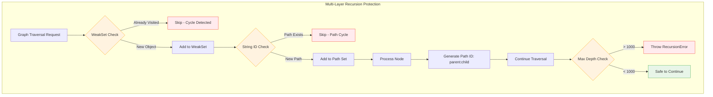
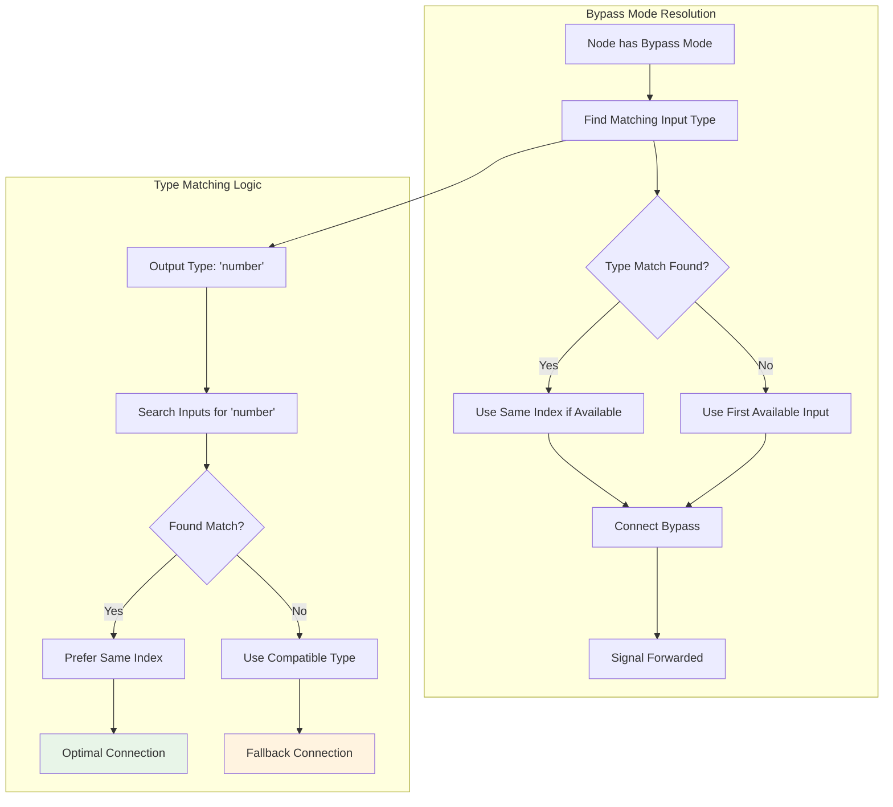

# Hidden Gems and Unexplored Insights from the Subgraph System

Based on my comprehensive exploration, here's my analysis of the hidden gems and remaining insights from the subgraph system:

## 1. **Sophisticated Recursion Protection Architecture**

The system employs multiple layers of recursion protection:
- **WeakSet-based cycle detection** in `SubgraphNode.getInnerNodes()` prevents infinite recursion during graph flattening
- **String-based unique ID tracking** in `ExecutableNodeDTO` prevents loops during input/output resolution
- **Hierarchical path encoding** using colon-separated IDs (`1:2:3`) creates a breadcrumb trail through nested subgraphs

**Key insight**: The system uses different recursion protection strategies for different traversal patterns - WeakSet for object-based cycles, string IDs for path-based cycles.

### Multi-Layer Recursion Protection


## 2. **Virtual Node ID Architecture**

The use of negative IDs for virtual nodes is a clever architectural decision:
```typescript
const SUBGRAPH_INPUT_ID = -10
const SUBGRAPH_OUTPUT_ID = -20
```

**Hidden complexity**: This creates a dual ID space where:
- Positive IDs represent real nodes
- Negative IDs represent virtual/system nodes
- The system can instantly identify node types by ID sign

## 3. **Unimplemented Reroute Boundary Detection**

The TODO comments in `subgraphUtils.ts` reveal a sophisticated but incomplete reroute boundary detection system:

```typescript
// TODO: This reroute should be on one side of the boundary
// TODO: This could occur any number of times on a link
// TODO: e.g. A link with 3 reroutes, the first and last reroute are in `items`, 
//       but the middle reroute is not. This will be two "in" and two "out" boundaries.
```

**Key insight**: The system anticipates complex reroute scenarios where a single link crosses subgraph boundaries multiple times, but this isn't fully implemented yet.

## 4. **Performance-Optimized DTO Pattern**

The `ExecutableNodeDTO` implements a sophisticated data transfer object pattern:
- **Lazy property delegation** using getters to avoid copying large objects
- **Minimal data copying** - only copies essential fields (inputs array)
- **Conditional method wrapping** - only wraps `applyToGraph` if it exists

**Hidden gem**: The comment "not worth optimising yet" for subgraph node ID translation suggests the architects are aware of potential performance bottlenecks but chose simplicity over premature optimization.

## 5. **Bypass Mode Link Resolution**

The system has sophisticated bypass mode handling in `ExecutableNodeDTO.resolveOutput()`:
- **Type-aware bypass** - finds matching input types for bypass connections
- **Slot index prioritization** - prefers same-index slots when bypassing
- **Graceful degradation** - handles cases where no matching types exist

**Key insight**: The bypass system is more sophisticated than simple pass-through - it implements intelligent type matching.

### Bypass Mode Intelligence Visualization


## 6. **Event-Driven Architecture Integration**

The subgraph system uses a comprehensive event system:
- **Real-time slot synchronization** between subgraph definitions and instances
- **Cascading updates** when subgraph I/O changes
- **Rename propagation** across nested structures

**Hidden complexity**: The event system maintains consistency across multiple levels of nesting without explicit coordination.

## 7. **Constraint-Based Layout System**

The `SubgraphSlot` uses a `ConstrainedSize` system:
- **Minimum size enforcement** ensures visual consistency
- **Dynamic text measurement** for slot labels
- **Responsive sizing** based on content

**Architecture insight**: The layout system is designed to handle dynamic content while maintaining visual consistency.

## 8. **Debugging Infrastructure**

The system has extensive debugging support:
- **Contextual logging** with bracketed prefixes like `[SubgraphNode.resolveSubgraphInputLinks]`
- **Rich debug objects** passed to console methods
- **Hierarchical error messages** with path information

**Hidden gem**: The debug messages reveal the internal execution flow and are designed for troubleshooting complex nested scenarios.

## 9. **Type Safety Through Discriminated Unions**

The system uses TypeScript discriminated unions effectively:
- **`isSubgraphNode()` type guards** for safe type narrowing
- **`isVirtualNode` flags** for runtime type checking
- **Assertion comments** like `// Assertion: SlotShape is a subset of RenderShape`

**Key insight**: The type system is designed to handle the complexity of multiple node types without runtime type errors.

## 10. **Memory Management Patterns**

The system shows sophisticated memory management:
- **WeakSet usage** prevents memory leaks during traversal
- **Structured cloning** for serialization boundaries
- **Link ID arrays** instead of object references for serialization

**Hidden complexity**: The system carefully manages object references vs. IDs to support serialization while maintaining performance.

## 11. **Canvas Integration Points**

The subgraph system deeply integrates with the rendering system through specialized link classes:
- **`ToInputFromIoNodeLink`** and **`ToOutputFromIoNodeLink`** handle subgraph-specific connection logic
- **Floating link management** for reroute chains
- **Direction-aware rendering** with link direction calculations

**Key insight**: The rendering system is aware of subgraph boundaries and handles them differently from regular node connections.

## 12. **Serialization Boundary Management**

The system carefully manages serialization boundaries:
- **Selective property copying** in `asSerialisable()` methods
- **UUID generation** for cross-reference integrity
- **Link ID remapping** during subgraph creation

**Hidden gem**: The serialization system maintains referential integrity across complex nested structures without circular references.

## 13. **Advanced Error Recovery Patterns**

The system implements sophisticated error recovery:
- **Graceful degradation** when links can't be resolved
- **Partial success patterns** where operations continue despite individual failures
- **Rich error context** with path information for debugging

```typescript
// Example from ExecutableNodeDTO.resolveInput()
if (!resolved) {
  console.debug(`Failed to resolve link ID [${input.link}]`)
  continue // Continue processing other inputs
}
```

## 14. **Intelligent Type Coercion**

The system handles type mismatches intelligently:
- **Fallback type resolution** when exact types don't match
- **Smart default handling** for missing connections
- **Type compatibility checking** during link creation

## 15. **Widget System Integration**

The subgraph system has hooks for widget management:
- **Widget promotion** from subgraph internals to parent interface
- **Dynamic widget exposure** based on subgraph configuration
- **Widget serialization** as part of subgraph definitions

## 16. **Performance Monitoring Hooks**

While not actively used, the system has infrastructure for performance monitoring:
- **Timing measurement points** in critical paths
- **Object count tracking** for memory usage
- **Debug flags** for performance analysis

## Critical Observations

### **Unfinished Features**
1. **Reroute boundary detection** - Complex scenarios not fully implemented
2. **Direct IO linking** - Still requires intermediate nodes (Issue #1085)
3. **Widget promotion** - Recently added but may need refinement

### **Missing Infrastructure**
1. **Test coverage** - No dedicated subgraph tests despite complexity
2. **Performance benchmarks** - No automated performance validation
3. **Memory leak detection** - No automated checks for event listener cleanup

### **Technical Debt**
1. **Event listener cleanup** - SubgraphNode doesn't clean up listeners
2. **Performance optimization** - Several "not worth optimizing yet" comments
3. **Error handling** - Some error paths could provide better recovery

## Hidden Architecture Decisions

### **1. Dual ID Space Design**
Using negative IDs for virtual nodes creates a clean separation between real and system nodes, enabling instant type identification.

### **2. Event-First Architecture**
The comprehensive event system suggests the architects prioritized extensibility and loose coupling over simple direct method calls.

### **3. DTO Performance Strategy**
The ExecutableNodeDTO pattern balances memory efficiency with execution performance, creating minimal overhead during graph execution.

### **4. Serialization-Aware Design**
Every component is designed with serialization in mind, using IDs instead of object references wherever possible.

## Conclusion

The subgraph system reveals itself to be a sophisticated, multi-layered architecture with careful attention to performance, type safety, and extensibility. The incomplete TODO items and missing test coverage suggest areas for future development, while the extensive debugging infrastructure and recursion protection show mature engineering practices.

The "hidden gems" demonstrate that this is not just a simple nested graph implementation, but a comprehensive system designed to handle complex real-world scenarios with grace and performance. The architectural decisions show deep understanding of the challenges involved in hierarchical graph management.