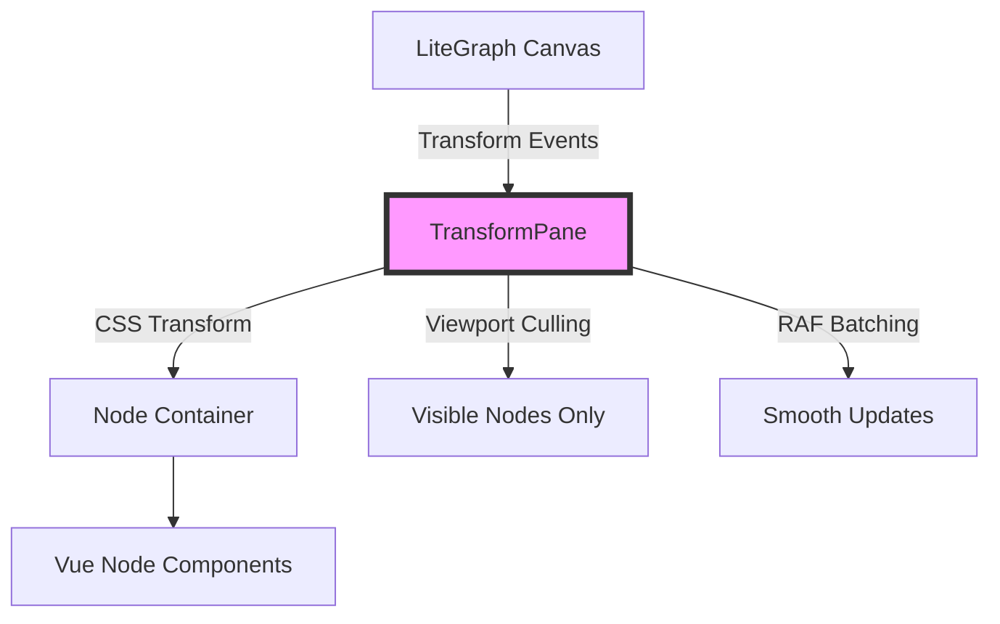

# TransformPane Implementation Proposal

## Overview

The TransformPane will be the critical performance layer that bridges LiteGraph's canvas-based coordinate system with Vue's DOM-based node rendering. It acts as a viewport container that synchronizes canvas transforms (pan/zoom) with DOM transforms, enabling smooth interaction while maintaining the performance characteristics needed for workflows with 100+ nodes.

## Architecture

### Core Concept



### Transform Strategy

Unlike React Flow/Vue Flow's single viewport transform approach, we'll implement a hybrid strategy inspired by tldraw's optimizations:

1. **Container Transform** - Pan/zoom via single CSS transform on TransformPane
2. **Individual Node Transforms** - Local position updates during drag operations
3. **Transform Isolation** - CSS containment to prevent reflow cascades
4. **Matrix-based Transform System** - Support for future rotation and complex transforms

## Implementation Details

### 1. TransformPane Component Structure

```typescript
// TransformPane.vue
interface TransformPaneProps {
  camera: { x: number; y: number; z: number }  // From LiteGraph
  nodes: LGraphNode[]                          // Visible nodes
  viewport: DOMRect                            // Canvas viewport
}

// Matrix utility for complex transforms (future rotation support)
class Mat {
  constructor(a: number, b: number, c: number, d: number, e: number, f: number)
  static compose(...matrices: Mat[]): Mat
  static toCssString(m: Mat): string
}
```

Key responsibilities:
- Apply viewport transform: `transform: scale(${z}) translate(${x}px, ${y}px)`
- Implement viewport culling for off-screen nodes
- Batch transform updates via requestAnimationFrame
- Manage drag operation state to avoid transform conflicts
- Provide matrix utilities for future transform complexity

### 2. Performance Optimizations

#### Memory Management with WeakMap
Use WeakMap for node-to-element references to prevent memory leaks:

```typescript
// Automatically garbage collected when nodes are removed
const nodeElements = new WeakMap<LGraphNode, HTMLElement>()
const nodeMetrics = new WeakMap<LGraphNode, NodeMetrics>()

// Usage
function registerNodeElement(node: LGraphNode, element: HTMLElement) {
  nodeElements.set(node, element)
}

// No manual cleanup needed - references cleared when node is GC'd
```

#### Transform Batching with CSS Custom Properties
- Queue transform updates and apply in RAF callback
- Prevent multiple reflows per frame during rapid pan/zoom
- Use CSS custom properties for efficient batch updates:

```typescript
// CSS
.litegraph-node {
  transform: translate(var(--node-x), var(--node-y));
}

// In RAF batch update
const updates = []
for (const node of nodesToUpdate) {
  updates.push(() => {
    node.element.style.setProperty('--node-x', `${node.x}px`)
    node.element.style.setProperty('--node-y', `${node.y}px`)
  })
}
// Single batch application
updates.forEach(update => update())

```

#### GPU Layer Promotion and CSS Containment
```css
.transform-pane {
  will-change: transform; /* Only during interaction */
  contain: layout style paint;
  transform-origin: 0 0; /* Critical for correct scaling */
}

.litegraph-node {
  contain: layout style paint size; /* Size containment for nodes */
  content-visibility: auto; /* Browser skips rendering off-screen nodes */
  transform-origin: 0 0;
}
```

##### will-change Management
```typescript
// Debounced will-change to avoid layer thrashing
let willChangeTimeout: number
function setInteractive(element: HTMLElement, isInteractive: boolean) {
  if (isInteractive) {
    element.style.willChange = 'transform'
  } else {
    clearTimeout(willChangeTimeout)
    willChangeTimeout = setTimeout(() => {
      element.style.willChange = 'auto'
    }, 200) // Delay removal to avoid thrashing
  }
}
```

#### Viewport Culling
- Calculate node bounds vs viewport intersection manually in RAF loop
- Only render nodes within expanded viewport bounds (20% margin)
- Use `content-visibility: auto` for optimal performance (better than v-show/v-if)
  - Keeps DOM structure (preserving state)
  - Browser skips render work for hidden nodes
  - No component mount/unmount overhead

#### Drag Operation Handling
- During drag: apply delta to node's local transform
- Use `transform: translate(${deltaX}px, ${deltaY}px)` for smooth dragging
- Use pointer capture API to maintain drag even when cursor leaves node
- On drag end: sync absolute position back to LiteGraph, reset local transform to zero
- Prevents transform multiplication issues and ensures smooth performance

#### Transform Order Considerations
Transform order is critical for correct rendering:
- **Container**: `scale(${z}) translate(${x}px, ${y}px)` - Scale THEN translate
- **Nodes**: `translate(${node.x}px, ${node.y}px)` - Position in container space
- **During drag**: `translate(${node.x}px, ${node.y}px) translate(${deltaX}px, ${deltaY}px)` - Base position THEN delta
- Incorrect order causes position/scale coupling issues

### 3. Coordinate System Synchronization

The TransformPane must handle coordinate translation between:
- **Canvas space** - LiteGraph's coordinate system
- **Screen space** - Mouse/pointer events
- **DOM space** - Vue component positioning

Key utilities needed:
```typescript
// Convert canvas coords to screen coords
canvasToScreen(point: Point, camera: Camera): Point

// Convert screen coords to canvas coords  
screenToCanvas(point: Point, camera: Camera): Point

// Get node's screen bounds for culling
getNodeScreenBounds(node: LGraphNode, camera: Camera): DOMRect

// Calculate fixed position for portaled overlays (PrimeVue components)
getPortalCoordinates(element: HTMLElement, camera: Camera): { x: number, y: number } {
  const rect = element.getBoundingClientRect()
  // Account for transform scaling when calculating portal position
  return {
    x: rect.left,
    y: rect.top
  }
}
```

### 4. Transform State Management

Since multiple components need access to transform state, implement a reactive composable:

```typescript
// useTransformState.ts
export const useTransformState = () => {
  // Reactive state mirroring LiteGraph's canvas transform
  const camera = reactive({
    x: 0,
    y: 0,
    z: 1 // scale/zoom
  })
  
  // Computed transform string for CSS
  const transformStyle = computed(() => ({
    transform: `scale(${camera.z}) translate(${camera.x}px, ${camera.y}px)`,
    transformOrigin: '0 0'
  }))
  
  // Sync with LiteGraph during draw cycle
  const syncWithCanvas = (canvas: LGraphCanvas) => {
    camera.x = canvas.offset[0]
    camera.y = canvas.offset[1]
    camera.z = canvas.scale
  }
  
  // Coordinate conversion utilities
  const canvasToScreen = (point: Point): Point => {
    return {
      x: point.x * camera.z + camera.x,
      y: point.y * camera.z + camera.y
    }
  }
  
  const screenToCanvas = (point: Point): Point => {
    return {
      x: (point.x - camera.x) / camera.z,
      y: (point.y - camera.y) / camera.z
    }
  }
  
  return {
    camera: readonly(camera),
    transformStyle,
    syncWithCanvas,
    canvasToScreen,
    screenToCanvas
  }
}
```

This provides:
- Reactive access to transform state for any component
- Automatic CSS transform generation
- Coordinate conversion utilities
- One-way sync from LiteGraph (maintains single source of truth)

### 5. Integration Points

#### With LiteGraph Canvas
- Listen to canvas pan/zoom events
- Subscribe to node position updates
- Emit pointer events back to canvas for connection dragging

#### With Vue Nodes
- Provide camera context via provide/inject
- Expose transform utilities to child components
- Manage node selection state

### 5. Level of Detail (LOD) System

Inspired by tldraw's approach:
- **Zoom < 0.5**: Simplified node rendering (title only)
- **Zoom 0.5-1.0**: Standard rendering
- **Zoom > 2.0**: Enhanced detail (if applicable)

### 6. Event Handling Strategy

#### Event System Architecture
- Use event delegation on TransformPane level for efficiency
- Single event listener handles all node interactions
- Pointer events on nodes set to 'auto' only when interactive

#### Event Routing
**Canvas retains control of:**
- Connection dragging
- Background pan/zoom  
- Box selection start
- Grid interactions

**DOM (TransformPane) handles:**
- All node interactions (click, drag, hover)
- Widget inputs and focus
- Context menus
- Node selection (after box select completes)

#### Implementation
```typescript
// Event delegation on TransformPane
transformPaneEl.addEventListener('pointerdown', (e) => {
  const target = e.target.closest('[data-node-id]')
  if (target) {
    const nodeId = target.dataset.nodeId
    // Route to appropriate node handler
    handleNodeInteraction(nodeId, e)
  }
})
```

## Migration Path

### Phase 1: Basic Transform Sync
- Implement TransformPane with basic pan/zoom
- Test with simple node positioning
- Measure performance baseline

### Phase 2: Optimization Layer
- Add viewport culling
- Implement RAF batching
- Add GPU hints and containment

### Phase 3: Advanced Features
- LOD system
- Drag operation handling
- Event delegation system

### Phase 4: Scale Optimization
- Implement spatial indexing for large graphs
- Performance budget system
- Advanced LOD optimizations

### Phase 5: Extension Support
- Compatibility layer for custom nodes
- Migration utilities
- Documentation

## Scale Optimizations

### Spatial Indexing with QuadTree

For workflows with 1000+ nodes, implement spatial indexing:

```typescript
// quadtree.ts
class QuadTree<T extends { pos: [number, number], size: [number, number] }> {
  private root: QuadNode<T>
  private nodeMap = new WeakMap<T, QuadNode<T>>()
  
  insert(item: T) {
    const node = this.root.insert(item, this.getBounds(item))
    this.nodeMap.set(item, node)
  }
  
  remove(item: T) {
    const node = this.nodeMap.get(item)
    if (node) {
      node.remove(item)
      this.nodeMap.delete(item)
    }
  }
  
  // O(log n) viewport query instead of O(n)
  query(bounds: DOMRect): T[] {
    return this.root.query(bounds)
  }
  
  // Update when node moves
  update(item: T, oldBounds: DOMRect, newBounds: DOMRect) {
    this.remove(item)
    this.insert(item)
  }
}

// Integration in TransformPane
const spatialIndex = new QuadTree<LGraphNode>()

// During initialization
nodes.forEach(node => spatialIndex.insert(node))

// For culling - much faster for large graphs
const visibleNodes = spatialIndex.query(expandedViewport)
```

### Performance Budget System

Dynamically adapt rendering quality based on performance:

```typescript
class PerformanceBudget {
  private frameTimeHistory: number[] = []
  private rafId: number
  
  // Measure frame time using RAF timestamps
  startMonitoring() {
    let lastTime = performance.now()
    
    const measure = (currentTime: number) => {
      const frameTime = currentTime - lastTime
      lastTime = currentTime
      
      // Keep rolling average of last 10 frames
      this.frameTimeHistory.push(frameTime)
      if (this.frameTimeHistory.length > 10) {
        this.frameTimeHistory.shift()
      }
      
      // Check if we need to adapt
      if (this.averageFrameTime > 20) { // Below 50fps
        this.degradeQuality()
      } else if (this.averageFrameTime < 12) { // Above 80fps
        this.improveQuality()
      }
      
      this.rafId = requestAnimationFrame(measure)
    }
    
    this.rafId = requestAnimationFrame(measure)
  }
  
  get averageFrameTime() {
    return this.frameTimeHistory.reduce((a, b) => a + b, 0) / this.frameTimeHistory.length
  }
  
  degradeQuality() {
    // Reduce quality when performance is poor
    this.lodThreshold *= 0.8      // Show simplified nodes earlier
    this.cullMargin = '0%'         // No viewport expansion
    this.enableAnimations = false   // Disable transitions
    console.log('Performance budget: Degrading quality')
  }
  
  improveQuality() {
    // Restore quality when performance improves
    this.lodThreshold = Math.min(this.lodThreshold * 1.1, 1.0)
    this.cullMargin = '20%'
    this.enableAnimations = true
  }
}
```

This approach:
- Uses RAF timestamps (no additional overhead)
- Maintains rolling average of frame times
- Automatically adapts rendering quality
- No complex profiling needed

## Performance Targets

Based on the research:
- 60 FPS during pan/zoom with 100 nodes
- < 16ms transform update cycle
- < 100ms initial render for large workflows
- Memory usage < 1.5x canvas-only approach

## Risk Mitigation

### Performance Risks
- **Mitigation**: Progressive enhancement, feature flags
- **Fallback**: Canvas-only rendering for large workflows

### Compatibility Risks  
- **Mitigation**: Extensive testing with popular extensions
- **Fallback**: Compatibility shim layer

### Complexity Risks
- **Mitigation**: Incremental implementation, thorough testing
- **Fallback**: Simplified transform strategy if needed

## Additional Features

### Debug Visualization (Development Mode)
- Viewport bounds overlay showing culling boundaries
- Node render status indicators (visible/culled/LOD level)
- Transform update counters per node
- GPU layer promotion indicators
- Performance metrics overlay (FPS, render time)
- Real-time metrics display:
  ```typescript
  interface PerformanceMetrics {
    fps: number
    frameTime: number
    visibleNodes: number
    culledNodes: number
    transformUpdateTime: number
    renderTime: number
    memoryUsage?: number // If available
  }
  ```
- FPS graph showing frame time history
- Metrics table overlay:
  ```vue
  <div class="debug-overlay" v-if="showDebug">
    <div class="metrics-table">
      <div>FPS: {{ Math.round(1000 / metrics.frameTime) }}</div>
      <div>Frame Time: {{ metrics.frameTime.toFixed(2) }}ms</div>
      <div>Visible Nodes: {{ metrics.visibleNodes }}/{{ totalNodes }}</div>
      <div>GPU Layers: {{ metrics.gpuLayers }}</div>
      <div>Transform: {{ camera.z.toFixed(2) }}x @ {{ camera.x.toFixed(0) }}, {{ camera.y.toFixed(0) }}</div>
    </div>
    <canvas class="fps-graph" ref="fpsGraph" />
  </div>
  ```
- Heatmap visualization for nodes with high update frequency
- Transform performance breakdown (pan vs zoom vs drag)
- Visual indicators for performance budget state (quality level)

### Safari Support Notes
- Add `-webkit-transform` prefixes for older Safari versions
- Test transform-origin behavior (Safari has quirks)
- Monitor for Safari-specific layer promotion issues
- **Future consideration**: If full Safari support needed, implement Safari-specific transform workarounds and test matrix

## Next Steps

1. Create minimal TransformPane prototype
2. Benchmark against performance targets
3. Iterate on optimization strategies
4. Test with real-world workflows
5. Document extension migration path

## Key Differences from Existing Solutions

Unlike React Flow/Vue Flow:
- **Hybrid rendering** - Canvas for connections, DOM for nodes
- **Selective updates** - Only transform what changes
- **Viewport culling** - Don't render off-screen nodes
- **LOD system** - Adapt detail to zoom level
- **LiteGraph integration** - Not a standalone solution

This approach combines the best of both worlds: the performance of canvas rendering for connections and viewport operations with the flexibility of DOM/Vue for rich node interfaces.